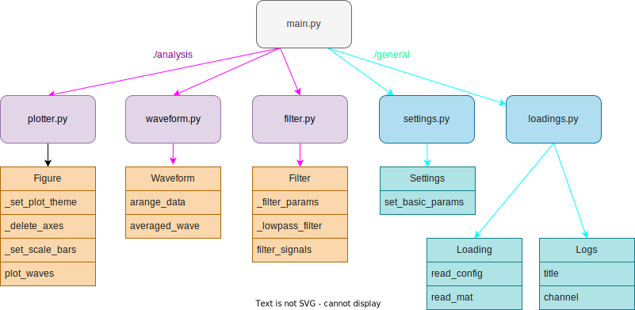

# EEG

## Design


## Installing
- Python
- rich
- scipy
- numpy
- matplotlib
- json

## Preparation
```config.json
{
    "directory": "working directory",
    "date": "experimental date",
    "file": "name of mat file",
    "scale": "EEG scale to use in plot"
}
